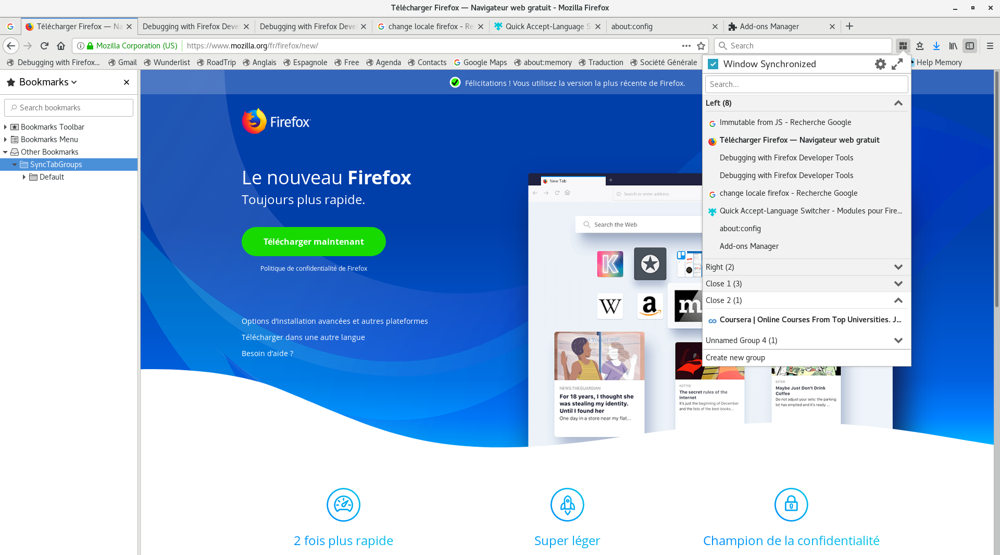

# Sync Tab Groups

Sync Tab Groups are an easy way to organize your current tabs depending on a topic. Each open group is synchronized with a window so that all tabs change are saved. Hence, you can close a current tabs-flow while opening another one. 

# Organize your browsing

 - Close or open groups of tabs for lightening your desktop or saving memory
 - Work with any windows in your browser
 - Share your groups with other people or devices
 - Private window can have a specific behavior
 - Pinned tabs can be included in groups or not
 - Save your groups as bookmarks for sharing them among all your devices (The tool is deprecated because of the instability. I will work on it soon.)

# A simple and powerful interface

 - See all your groups and tabs
 - Manage them and switch to them
 - Sort your groups and tabs
 - Many settings to make the extension behaves like you want it
 - Usage guide: [see the screenshots](https://addons.mozilla.org/en-US/firefox/addon/sync-tab-groups/)
 - Many shortcuts

# Limitations (Important for not losing data)

 - Tabs in closed group are REALLY closed
 - Switching to a group, close all the current tabs in the window
 - Previous sessions (back button) are lost when closing a group
 - Temporary data like forms are lost when closing a group
 - All tabs are loaded when a group is opened (Will be fixed with Firefox 58 on January) ([More info](https://github.com/Morikko/sync-tab-groups/issues/5#issuecomment-344753295))

# Notes
This extension is really young (2 weeks) and often changes. I am developing it actively at the moment. Many features are coming.

# About other Tabs Groups addon

Sync Tab Groups (STG) is not related to [Tab Groups](https://addons.mozilla.org/en-US/firefox/addon/tab-groups-panorama/).

STG is not able to hide tabs, instead tabs are closed. However, if this doesn't stop you, STG accepts importing groups from tab Groups extension.

# Languages
 - English
 - French
 - German (thanks @bitkleberAST) 
 - Russian (thanks Александр) 

I would gladly accept other translations. Add it in `_locales/`, while following the en (English) file. Change message and description parts only.

# Bugs
If you find a bug, please [open an issue](https://github.com/Morikko/sync-tab-groups/issues).

# Thanks
Thank you all of you for helping me improving and fixing the extension :)

I thank [denschub/firefox-tabgroups](https://github.com/denschub/firefox-tabgroups) for his UI code I reused as a base.
