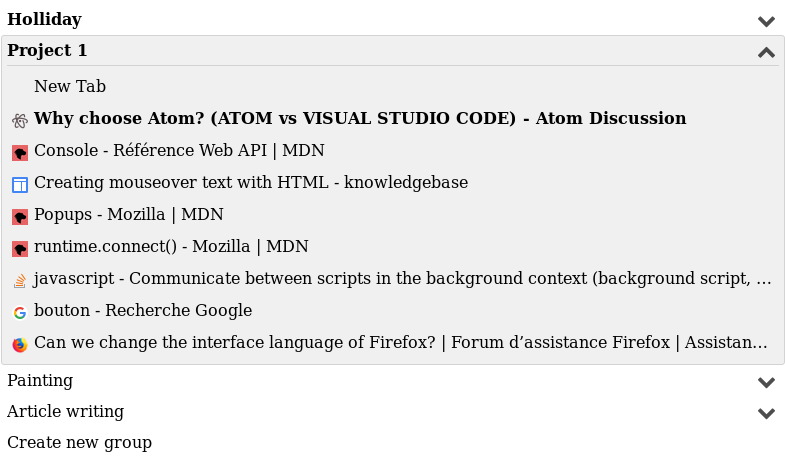

# Sync Tab Groups

Sync Tab Groups are an easy way to organize your current tabs depending on a topic. Each open group is synchronized with a window so that all tabs change are saved. Hence, you can close a current tabs-flow while opening another one. 

# Usage
- Closing groups you are not using now and restoring them back when you need them.
- Tabs synchronized in group change as they change in your window. (You don't have to save all tabs, open all tabs in bookmark).
- Tabs in closed group are really close, Firefox won't use memory any more for them

# About other Tabs Groups addon

Sync Tab Groups (STG) differs from [Tab Groups](https://addons.mozilla.org/en-US/firefox/addon/tab-groups-panorama/) and [Simplified Tab Groups](https://addons.mozilla.org/en-US/firefox/addon/tab-groups/) (TGs).

- STG uses the new Firefox API
- TGs use the previous and deprecated API
- STG closes the tabs and is synchronized over all windows
- TGs hide/show tabs and is related to a specific window

Due to the new API, I won't be able to add hide/show tabs for improving speed change, neither to restore session when tabs are reopened.

# Future Features
- Keybinding
- Move tabs from menu on right click on tab page
- Option to track/untrack pinned tabs
- Option to track/untrack private window

# Languages
Only English and French. You can add your own one in `_locales/`

# Bugs
If you find a bug, please [open an issue](https://github.com/Morikko/sync-tab-groups/issues) or send me an email.

# Thanks
I thank [denschub/firefox-tabgroups](https://github.com/denschub/firefox-tabgroups) for his UI code, I reused as a base.
